# Demo Project 1

Deploy MongoDB and Mongo Express into local K8s cluster

## Technologies Used

Kubernetes, Docker, MongoDB, Mongo Express

## Project Description

- Setup local K8s cluster with Minikube
- Deploy MongoDB and MongoExpress with configuration and credentials extracted into
- ConfigMap and Secret

### Details of project

- Minikube and kubectl Configuration

  As the starting point of the project, Minikube and kubectl need to be installed on the local machine. This was done by following the tutorials presented in the videos.  

  

- Create a MongoDB Deployment

  Below is the initial configuration file for MongoDB, saved in the file mongo.yaml:

  ```
    apiVersion: apps/v1
    kind: Deployment
    metadata:
    name: mongodb-deployment
    labels:
        app: mongodb
    spec:
    replicas: 1
    selector:
        matchLabels:
        app: mongodb
    template:
        metadata:
        labels:
            app: mongodb
        spec:
        containers:
        - name: mongodb
            image: mongo
  ```

  According to the Docker Hub documentation, MongoDB listens on port 27017, and some environment variables need to be set. However, you must handle user and password values carefully when adding them to the code.

  The username and password are sensitive values, so they should be set using a Secret (saved in a file named mongo-secret.yaml). These values must be encoded in base64 format, which can be generated via the terminal:

  ```
    echo -n 'username' | base64
  ```

  ```
    data:
      mongo-root-username: dXNlcm5hbWU=
      mongo-root-password: cGFzc3dvcmQ=
  ```

  It's important to note that the order of resource creation matters. First, create the Secret, and then use it in the MongoDB deployment. To create the Secret, run:

  ```
    data:
      mongo-root-username: dXNlcm5hbWU=
      mongo-root-password: cGFzc3dvcmQ=
  ```

  ```
    kubectl apply -f mongo-secret.yaml
  ```
  Once the Secret is created, it can be referenced in the MongoDB deployment file:

  ```
    spec:
    containers:
    - name: mongodb
        image: mongo
        ports:
        - containerPort: 27017
        env:
        - name: MONGO_INITDB_ROOT_USERNAME
        valueFrom:
            secretKeyRef:
            name: mongodb-secret
            key: mongo-root-username
        - name: MONGO_INITDB_ROOT_PASSWORD
        valueFrom:
            secretKeyRef:
            name: mongodb-secret
            key: mongo-root-password  
  ```
  To create the deployment, run the following command:

  ```
    kubectl apply -f mongo.yaml
  ```
  

- Create an Internal Service

  The service was created in the same file of the deployment:

  ```
    apiVersion: v1
    kind: Service
    metadata:
    name: mongodb-service
    spec:
    selector:
        app: mongodb
    ports:
    - protocol: TCP
        port: 27017
        targetPort: 27017
  ```
  Here, the selector references the name of the application configured in the deployment, and the port mapping uses the container's port.

- Create mongo-express with a ConfigMap

  As noted in the Docker Hub documentation, mongo-express listens on port 8081 and requires three environment variables to run (MongoDB address, username, and password). The pod configuration is as follows, in the file mongo-express.yaml:

  ```
    spec:
    containers:
    - name: mongo-express
        image: mongo-express
        ports:
        - containerPort: 8081
        env:
        - name: ME_CONFIG_MONGODB_ADMINUSERNAME
        valueFrom:
            secretKeyRef:
            name: mongodb-secret
            key: mongo-root-username
        - name: ME_CONFIG_MONGODB_ADMINPASSWORD
        valueFrom:
            secretKeyRef:
            name: mongodb-secret
            key: mongo-root-password
        - name: ME_CONFIG_MONGODB_SERVER
        valueFrom:
            configMapKeyRef:
            name: mongodb-configmap
            key: database_url
  ```
  The MongoDB URL is set in the ConfigMap (mongo-configmap.yaml), allowing other components to access it.

  ```
    apiVersion: v1
    kind: ConfigMap
    metadata:
        name: mongodb-configmap
    data:
        database_url: mongodb-service  
  ```
  The only value configured here is the MongoDB URL, which refers to the MongoDB service. The ConfigMap must be created first, so it can be used in the deployment, using kubect apply -f "name of the files"

  

  - Accessing mongo-express via Browser

    To access mongo-express, you need to create a service. There are two differences compared to the previous MongoDB service: 
      - The service type is set to LoadBalancer to allow external requests.
      - A nodePort is assigned, which should be within the range 30000-32767 for external access.

  ```
    apiVersion: v1
    kind: Service
    metadata:
    name: mongo-express-service
    spec:
    selector:
        app: mongo-express
    type: LoadBalancer
    ports:
    - protocol: TCP
        port: 8081
        targetPort: 8081
        nodePort: 30000 
  ```
  The kubectl needs to run again to create the service. 

  

  You might notice that the connection to mongo-express appears as pending because Minikube works differently from traditional Kubernetes. Since Minikube doesn't have an external IP by default, you can access the application using the following command:

  ```
    minikube service mongo-express-service
  ```
  This will assign an external service to the public IP, and the application can then be accessed via a web browser.

  

# Demo Project 2

Deploy Mosquitto message broker with ConfigMap and Secret Volume Types

## Technologies Used

Kubernetes, Docker, Mosquitto

## Project Description

- Define configuration and passwords for Mosquitto message broker with ConfigMap and Secret Volume types

### Details of project

The files used in this project can be found in this repository, under the folder configmap-and-secret-volume-types.

- Creating a ConfigMap

  In this project, both the ConfigMap and Secret will be used to generate files that will be utilized by the Mosquitto pod, a message broker used for demonstration purposes.

  The ConfigMap and Secret are set to create a file, with the name defined after the data section, and the content written after the pipe will be the file's content. The Secret's content is encoded in base64 format.

- Deploying Mosquitto Without Volumes

  In this section, a deployment was created using Minikube with the file mosquitto-without-volumes.yaml.

  ```
    kubectl apply -f mosquitto-without-volumes.yaml
  ```

  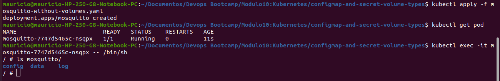

  We can see that the deployment was successfully created, and upon entering the container, it’s possible to access its default files. Mosquitto has a default configuration file called mosquitto.conf, which will be overwritten using the ConfigMap by mounting it inside the container.

- Applying the ConfigMap and Secret

  The ConfigMap and Secret must be created before the Mosquitto pod to avoid execution errors.

  ```
    kubectl apply -f config-file.yaml
  ```

  ```
    kubectl apply -f secret-file.yaml
  ```

  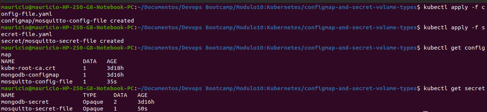

- Configuring mosquitto.yaml

  To allow Mosquitto to use the volumes created by the ConfigMap and Secret, a volumes attribute is added at the container level. This will create the volumes inside the pod:

  ```
    volumes:
      - name: mosquitto-config
        configMap:
          name: mosquitto-config-file
      - name: mosquitto-secret
        secret:
          secretName: mosquitto-secret-file
  ```   
  Next, the volumes must be mounted inside the container. They need to be available in the pods and mounted in the correct directories to ensure the proper overwriting of files. Setting readOnly: true ensures that the files cannot be modified by the application.

  ```
    volumeMounts: 
      - name: mosquitto-config
        mountPath: /mosquitto/config
      - name: mosquitto-secret
        mountPath: /mosquitto/secret
        readOnly: true
  ```

  ```
    kubectl apply -f mosquitto.yaml
  ```
  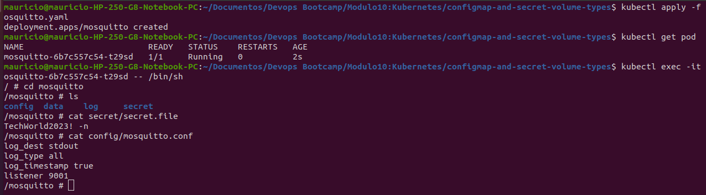

  After entering the container, we can confirm that the secret.file was successfully created, and the mosquitto.conf file was updated with the content defined in the ConfigMap.

# Demo Project 3

Install a stateful service (MongoDB) on Kubernetes usingHelm

## Technologies Used

K8s, Helm, MongoDB, Mongo Express, Linode LKE, Linux

## Project Description

- Create a managed K8s cluster with Linode Kubernetes Engine
- Deploy replicated MongoDB service in LKE cluster using a Helm chart
- Configure data persistence for MongoDB with Linode’s cloud storage
- Deploy UI client Mongo Express for MongoDB
- Deploy and configure nginx ingress to access the UI application from browser

### Details of project

- Deploying a Kubernetes Cluster on Linode

  1- Create the K8s Cluster on Linode
  Within Linode, two instances of a 4 GB Shared CPU Linode were created.

  2- Cluster Access Configuration
  After setting up the cluster, the access file was downloaded to allow local kubectl commands within the cluster.

  3- Setting the kubeconfig as an Environment Variable

  ```
    chmod 400 test-kubeconfig.yaml
    export KUBECONFIG=test-kubeconfig.yaml
  ```

  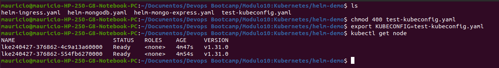

  4- Verification of Cluster Nodes 
  By running kubectl get node, it can be observed the two Linode worker nodes, indicating that the connection to Linode is established, and deployments can be managed using kubectl.

- Deploying MongoDB StatefulSet

  The Helm was installed and the repository containing the MongoDB Helm chart was addes:

  ```
    helm repo add bitnami https://charts.bitnami.com/bitnami
  ```

  Now that Bitnami is connected, the MongoDB repository is accessible on the cluster.

  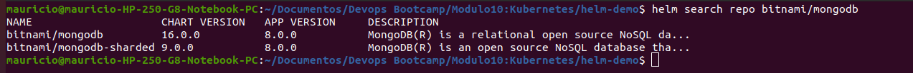

- Configuring MongoDB

  MongoDB requires custom configurations (such as StatefulSet, password, and volume settings). These parameters are available in the official documentation.
  A custom file (helm-mongodb.yaml) will be created to override these parameters, connecting the cluster with Linode, creating physical storage, attaching it to the pod, and setting a custom password.

- Install MongoDB Chart with Custom Configurations

  ```
    helm install mongodb --values helm-mongodb.yaml bitnami/mongodb
  ```
  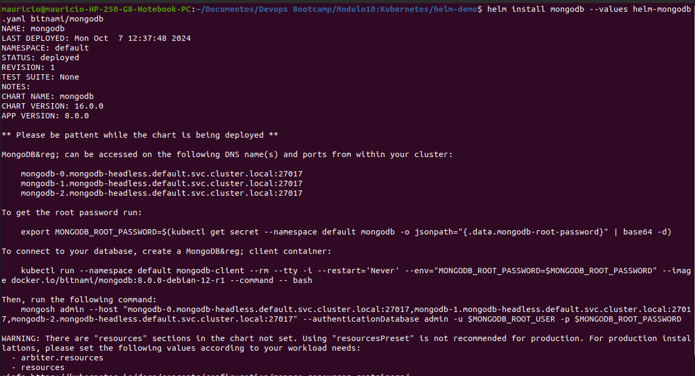

  All resources created with Helm can be observed, including three volumes on Linode—one for each replica—completing the MongoDB deployment via Helm. Unlike the previous project, a separate deployment wasn’t required.

- Deploying Mongo Express
  Mongo Express is simpler to deploy with a single pod and service, configured in a YAML file similar to Project 1. However, no nodePort is used here, as an Ingress will be set up for browser access.

  ```
    kubectl apply -f helm-mongo-express.yaml
  ```

- Installing the Ingress Controller with Helm

  Add and Install the Ingress NGINX Helm Chart

  ```
    helm repo add ingress-nginx https://kubernetes.github.io/ingress-nginx
  ```
  ```
    helm install nginx-ingress ingress-nginx/ingress-nginx --set controller.publishService.enabled=true
  ```

  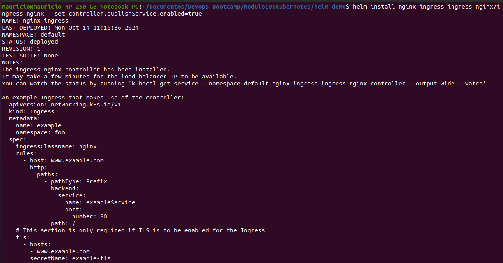

  Now that the Ingress is running, Ingress rules for routes and domain names can be added. In Linode, a NodeBalancer was also created to serve as the cluster’s entry point, associating the internal service with an external IP. The file containing the ingress rules is helm-ingresss.yaml.

  In this file, the host uses the NodeBalancer’s hostname; however, in production, the app’s DNS is preferred. This configuration associates the Mongo Express service with the specified port. To apply the ingress configuration:

- Applying the Ingress Configuration

  ```
    kubectl apply -f helm-ingress.yaml
  ```

  After creating the Ingress, the application is accessible externally via the hostname defined in the Ingress rule.

  

- Persistent Volume Management and Scaling

  Since the application uses persistent volumes, data will be reattached even if the pods are restarted.

  ```
    kubectl scale --replicas=0 statefulset/mongodb
  ```
  ```
    kubectl scale --replicas=3 statefulset/mongodb
  ```

  One benefit of using Helm is the ability to easily uninstall with a single command:

  ```
    helm uninstall mongodb
  ```

  After uninstalling, the Linode volumes will have an "Unattached" status. However, they can be reattached if MongoDB is redeployed, allowing previously stored information to be recovered.

# Demo Project 4

Deploy our web application in K8s cluster from private Docker registry

## Technologies Used

Kubernetes, Helm, AWS ECR, Docker

## Project Description

- Create Secret for credentials for the private Docker registry
- Configure the Docker registry secret in application Deployment component
- Deploy web application image from our private Docker registry in K8s cluster

### Details of project

- Docker login inside minikube

  As shown in the demo video, the application was uploaded to Amazon ECR so the same commands could be applied, but with the credentials of my own repository. The login to docker repository command was provided by ECR:

  ```
    aws ecr get-login-password --region us-east-1 | docker login --username AWS --password-stdin 808826729764.dkr.ecr.us-east-1.amazonaws.com
  ```

  Even though I completed the login, Minikube doesn’t have access to the credentials stored on my PC. Therefore, a different method was used to log in to the repository through Minikube.

  First, extract the login token by running:

  ```
    aws ecr get-login-password
  ```

  SSH into Minikube

  ```
    minikube ssh
  ```

  Use the docker login command within Minikube, but instead of using a password, use the token generated in the previous step along with the ECR URL:

  ```
    docker login --username AWS -p <TOKEN> 808826729764.dkr.ecr.us-east-1.amazonaws.com
  ```
  
  After this command is executed, a .docker folder with config.json is generated in Minikube, containing the token as repository access credentials. This will be used in the Secret.

- Create the Secret with credentials (docker-secret.yaml)

  A Secret file was created with the dockerconfigjson type, where the .dockerconfigjson attribute value is the Base64-encrypted content of the config.json file. To do this, the file was copied from Minikube to the host for use with kubectl.

  ```
    minikube cp minikube:/home/docker/.docker/config.json /home/username/.docker/config.json
  ```
  
  The content on the host was then replaced with the one from Minikube, allowing it to be converted to Base64 and included in the Secret:

  ``` 
    cat .docker/config.json | base64
  ```
  
  Another way to create the Secret is by using a command that creates a generic Secret and sets the values, inserting them into the attributes using the .docker/config.json file directly:

  ``` 
    kubectl create secret generic my-registry-key --from-file=.dockerconfigjson=.docker/config.json --type=kubernetes.io/dockerconfigjson
  ``` 

  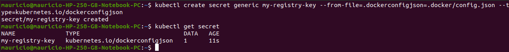

  Additionally, the Secret can be created in a single command by setting the Secret type as docker-registry and configuring the server, username, and password directly:

  ``` 
    kubectl create secret docker-registry my-registry-key-two \
    --docker-server=https://808826729764.dkr.ecr.us-east-1.amazonaws.com \
    --docker-username=AWS \
    --docker-password=<TOKEN>
  ``` 
  
  This approach allows Minikube to access the private repository securely, ensuring credentials are handled appropriately.

- Create the deployment (my-app-deployment.yaml)

  The deployment file includes the essential configurations to launch the pod. In the containers section, set the image field to the URI of your ECR repository image. Additionally, use the imagePullPolicy attribute to ensure the deployment always pulls the latest image from ECR, even if a local version exists. Configure it to use the previously created Secret by setting the imagePullSecrets attribute.

  Run the kubectl describe command on the pod to verify that the image has been successfully pulled from ECR:

  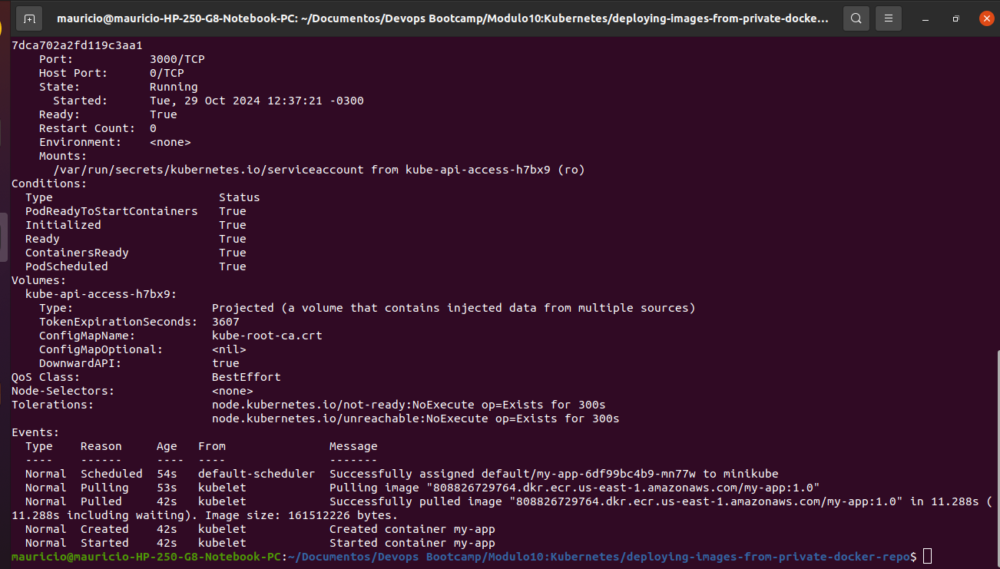
  
  Ensure that the Secret is located in the same namespace as the deployment, as Kubernetes will only access the Secret if they share a namespace.

# Demo Project 5

Deploy Microservices application in Kubernetes with Production & Security Best Practices

## Technologies Used

Kubernetes, Redis, Linux, Linode LKE

## Project Description

- Create K8s manifests for Deployments and Services for all microservices of an online shop application
- Deploy microservices to Linode’s managed Kubernetes cluster

### Details of project

- Deployment and Service Configuration of Microservices

  In this step, a single config.yaml file will be used to define all deployments and services for the 10 microservices in the application, along with a deployment for Redis. The configurations will include the names of the microservices, their interconnections, the environment variables required to run the application, and the accessible ports.

  - Email Service

    Image: gcr.io/google-samples/microservices-demo/emailservice:v0.8.0
    Container port: 8080
    Service port: 5000
    Env: PORT=8080

  - Product Catalog Service (connects to the product catalog service)

    Image: gcr.io/google-samples/microservices-demo/productcatalogservice:v0.8.0
    Container and Service port: 3550
    Env: PORT=3550

  - Recommendation Service (connects to the product catalog service)

    Image: gcr.io/google-samples/microservices-demo/recommendationservice:v0.8.0
    Container and Service port: 8080
    Env: PORT=8080
    Env: PRODUCT_CATALOG_SERVICE_ADDR="productcatalogservice:3550"

  - Payment Service

    Image: gcr.io/google-samples/microservices-demo/paymentservice:v0.8.0
    Container and Service port: 50051
    Env: PORT=50051
    Env: DISABLE_PROFILER=1

  - Currency Service

    Image: gcr.io/google-samples/microservices-demo/currencyservice:v0.8.0
    Container and Service port: 7000
    Env: PORT=7000
    Env: DISABLE_PROFILER=1

  - Shipping Service

    Image: gcr.io/google-samples/microservices-demo/shippingservice:v0.8.0
    Container and Service port: 50051
    Env: PORT=50051

  - Ad Service

    Image: gcr.io/google-samples/microservices-demo/adservice:v0.8.0
    Container and Service port: 9555
    Env: PORT=9555

  - Redis Service

    Image: redis:alpine (Docker Hub)
    Container and Service port: 6379

  - Cart Service (connects to Redis)

    Image: gcr.io/google-samples/microservices-demo/cartservice:v0.8.0
    Container and Service port: 7070
    Env: PORT=7070
    Env: REDIS_ADDR="redis-cart:6379"

  - Checkout Service (connects to 6 microservices)

    Image: gcr.io/google-samples/microservices-demo/checkoutservice:v0.8.0
    Container and Service port: 5050
    Env: PORT=5050
    Multiple connection variables: PRODUCT_CATALOG_SERVICE_ADDR, SHIPPING_SERVICE_ADDR, PAYMENT_SERVICE_ADDR, EMAIL_SERVICE_ADDR, CURRENCY_SERVICE_ADDR, CART_SERVICE_ADDR

  - Frontend (connects to 7 microservices)

    Image: gcr.io/google-samples/microservices-demo/frontend:v0.8.0
    Container and Service port: 8080
    Node port: 30007
    Multiple connection variables for other services.

- Deploy Microservices to K8s Cluster
  A Kubernetes cluster was created on Linode, with the connection file downloaded and secured with chmod 400. The environment was set with export KUBECONFIG to use the Linode configuration file.

  Steps:

  Create a namespace for the microservices deployment:

  ```
    kubectl create ns microservice
  ```

  Deploy the services:

  ```
    kubectl apply -f config.yaml -n microservice
  ```

  Once deployed, the application can be accessed via any IP address of the 3 Linode nodes on port 30007.

  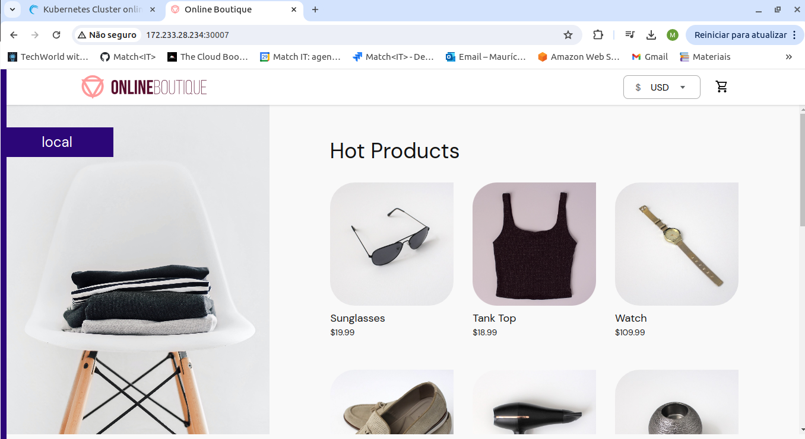

- Kubernetes Deployment Best Practices

  Pinned Tag Versions for Container Images: All images are pinned to a specific version, here v0.8.0, to ensure consistent deployments.

  Liveness Probe for Each Container: Enables Kubernetes to monitor application health and restart containers when necessary.

  ```
    livenessProbe:
      grpc:
        port: 8080
      periodSeconds: 5
  ```

  Readiness Probe for Each Container: Ensures that containers are only marked as ready when they are ready to receive traffic.

  ```
    readinessProbe:
      grpc:
        port: 3550
      periodSeconds: 5
  ```

  Different protocols, like HTTP for frontend and TCP for Redis, were configured as needed.

  Resource Requests and Limits: Sets CPU and memory requests and limits to manage resource allocation.

  ```
    resources:
      requests:
        cpu: 70m
        memory: 200Mi
      limits:
        cpu: 125m
        memory: 300Mi
  ```
    
  Avoid NodePort Exposure: NodePort is insecure as it opens ports on all worker nodes. Instead, use a LoadBalancer service or Ingress to manage single-entry points.

  Multiple Replicas per Pod: Ensures high availability by having at least two replicas for each microservice.

  Multiple Worker Nodes: Protects against downtime if a single server fails or requires maintenance.

  Use of Labels and Namespaces: Labels group related pods, while namespaces isolate components and facilitate cluster management, providing flexible access control across teams.

# Demo Project 6

Create Helm Chart for Microservices

## Technologies Used

Kubernetes, Helm

## Project Description

- Create 1 shared Helm Chart for all microservices, to reuse common Deployment and Service configurations for the services

### Details of project

  In this project, a single Helm chart was created for all microservices due to their similar configurations.

  First, a Helm chart was generated with the following command:

  ```
    helm create microservice
  ```

  This command created a directory containing some standard configuration files.

  - chart.yaml: Metadata about the chart
  - charts: Directory that contains chart dependencies
  - .helmignore: Files excluded from the Helm chart
  - templates: Directory for creating Kubernetes YAML files
  - values.yaml: Contains values used in the templates

- Configuring the templates/deployment.yaml and service.yaml files

  The deployment file was based on a template used in previous projects. Placeholders were used for each attribute's values, as shown in the following example:

  ```
    name: {{ .Values.varName }}
  ```
  The Values is a built-in object that takes values from the values.yaml file. With this setup, modifying values in this file will automatically update the deployment.

  In the service file, additional variables were created for the service type, such as load balancer for certain cases, and ports, which may differ from the target port.

- Dynamic Environment Variables

  Each microservice has a unique set of environment variables. To handle this in the template, a built-in function called range was used to iterate over and populate the template dynamically.

  ```
    env:
    {{- range .Values.containerEnvVars }}
      - name: {{ .name }}
        value: {{ .value | quote }}
    {{- end }}
  ```

- Setting Values

  Each microservice has a .yaml file containing the values that will be used in both the deployment and service templates. This centralizes configuration for each microservice in a single YAML file. To verify the correctness of the created templates, the command below was used:

  ```
    helm template -f service.yaml microservice
  ```

  If there are syntax errors in the template, this command will display them. If the template is correct, it will show a preview of the values that will be used for resource creation.

  The helm lint command can also be used to check for errors or warnings.

# Demo Project 7

Deploy Microservices with Helmfile

## Technologies Used

Kubernetes, Helm, Helmfile

## Project Description

- Deploy Microservices with Helm
- Deploy Microservices with Helmfile

### Details of project

- Deploying the Microservice

  ```
  helm install -f service.yaml releasename microservice
  ```
  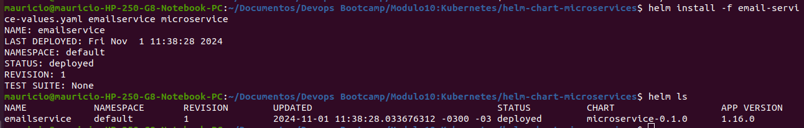

  The image above shows the successful deployment of the email service.

- Creating Values Files for All Microservices

  Once the process was validated for one microservice, additional values files were created for the other microservices in the values folder. Each microservice can then be deployed with the following command:

  ```
    helm install -f values/recommendation-service-values.yaml recommendationservice microservice
  ```

- Redis Configuration

  As Redis is a third-party application, it does not follow the same template created for the microservices and requires separate configuration.

  Creating Redis Helm Chart

  ```
    helm create redis
  ```

  In the newly created folder, new deployment and service files were configured specifically for Redis. Both the microservice Helm chart and Redis chart were placed in a folder named charts. To validate the Redis template:

  ```
  helm template -f values/redis-values.yaml charts/redis
  ```

  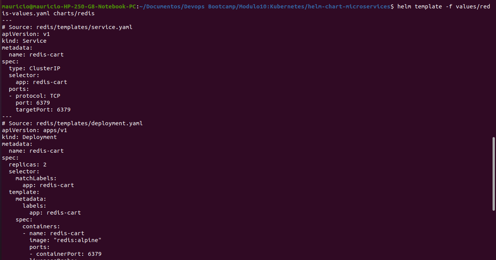

  The image above shows that the template is validated with the values to be used in the deployment creation.

- Deploying All Microservices

  To automate the deployment of all microservices, a shell script (install.sh) was created to run all the necessary commands.

  ```
    chmod u+x install.sh
    ./install.sh
  ```
  
- Using Helmfile for an Elegant Deployment

  Rather than running the same command multiple times, Helmfile can be used for a more efficient deployment. First, Helm releases were uninstalled using a script (uninstall.sh).

  Creating a Helmfile
  
  This YAML file is organized by releases and includes attributes like:

  ```
    releases:
      - name: rediscart
        chart: charts/redis # path to the helm chart
        values:
          - values/redis-values.yaml # path to the values file
          - appReplicas: "1" # name of the replica variable
          - volumeName: "redis-cart-data"
  ```

  Helmfile had been previously installed in earlier demos. To use it, run:

  ```
    helmfile sync
  ```

  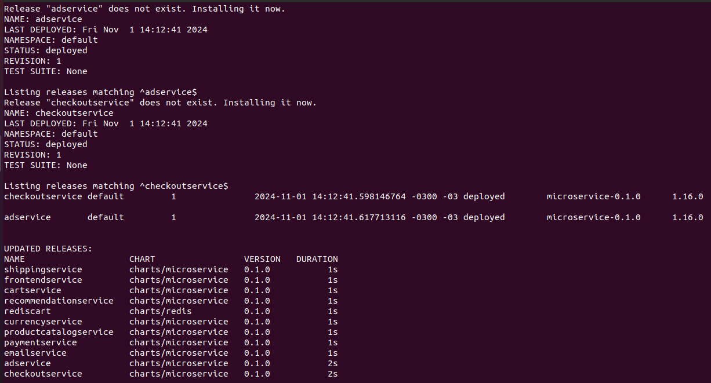

  The image above shows the command output, which prepares all releases, compares the current cluster state with the desired state in the Helmfile, and plans the installations and deployments required to reach the desired state. Running kubectl get pod confirms that all microservices are active.

  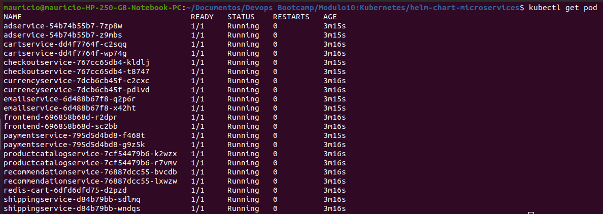

  Here is shown the application running when accessed via the IP address of the Linode node balancer.

- Uninstalling Releases
  All releases can be removed with the following command:

  ```
    helmfile destroy
  ```