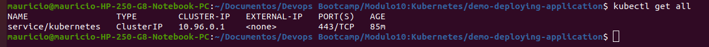
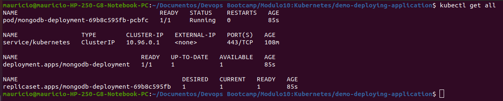
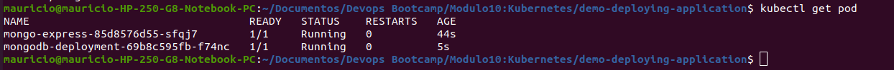
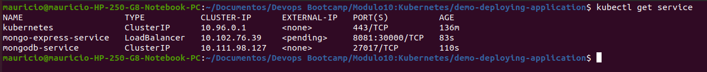
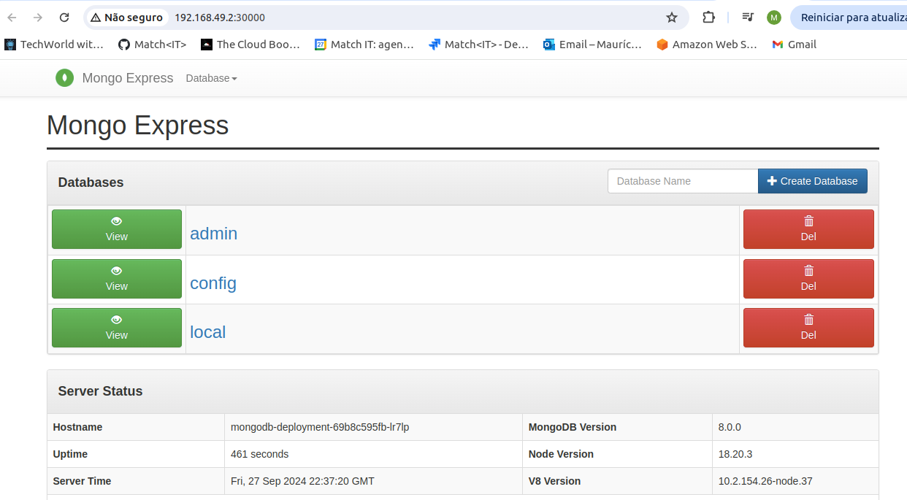

# Demo Project 1

Deploy MongoDB and Mongo Express into local K8s cluster

## Technologies Used

Kubernetes, Docker, MongoDB, Mongo Express

## Project Description

- Setup local K8s cluster with Minikube
- Deploy MongoDB and MongoExpress with configuration and credentials extracted into
- ConfigMap and Secret

### Details of project

- Minikube and kubectl Configuration

  As the starting point of the project, Minikube and kubectl need to be installed on the local machine. This was done by following the tutorials presented in the videos.  

  

- Create a MongoDB Deployment

  Below is the initial configuration file for MongoDB, saved in the file mongo.yaml:

  ```
    apiVersion: apps/v1
    kind: Deployment
    metadata:
    name: mongodb-deployment
    labels:
        app: mongodb
    spec:
    replicas: 1
    selector:
        matchLabels:
        app: mongodb
    template:
        metadata:
        labels:
            app: mongodb
        spec:
        containers:
        - name: mongodb
            image: mongo
  ```

  According to the Docker Hub documentation, MongoDB listens on port 27017, and some environment variables need to be set. However, you must handle user and password values carefully when adding them to the code.

  The username and password are sensitive values, so they should be set using a Secret (saved in a file named mongo-secret.yaml). These values must be encoded in base64 format, which can be generated via the terminal:

  ```
    echo -n 'username' | base64
  ```

  ```
    data:
      mongo-root-username: dXNlcm5hbWU=
      mongo-root-password: cGFzc3dvcmQ=
  ```

  It's important to note that the order of resource creation matters. First, create the Secret, and then use it in the MongoDB deployment. To create the Secret, run:

  ```
    data:
      mongo-root-username: dXNlcm5hbWU=
      mongo-root-password: cGFzc3dvcmQ=
  ```

  ```
    kubectl apply -f mongo-secret.yaml
  ```
  Once the Secret is created, it can be referenced in the MongoDB deployment file:

  ```
    spec:
    containers:
    - name: mongodb
        image: mongo
        ports:
        - containerPort: 27017
        env:
        - name: MONGO_INITDB_ROOT_USERNAME
        valueFrom:
            secretKeyRef:
            name: mongodb-secret
            key: mongo-root-username
        - name: MONGO_INITDB_ROOT_PASSWORD
        valueFrom:
            secretKeyRef:
            name: mongodb-secret
            key: mongo-root-password  
  ```
  To create the deployment, run the following command:

  ```
    kubectl apply -f mongo.yaml
  ```
  

- Create an Internal Service

  The service was created in the same file of the deployment:

  ```
    apiVersion: v1
    kind: Service
    metadata:
    name: mongodb-service
    spec:
    selector:
        app: mongodb
    ports:
    - protocol: TCP
        port: 27017
        targetPort: 27017
  ```
  Here, the selector references the name of the application configured in the deployment, and the port mapping uses the container's port.

- Create mongo-express with a ConfigMap

  As noted in the Docker Hub documentation, mongo-express listens on port 8081 and requires three environment variables to run (MongoDB address, username, and password). The pod configuration is as follows, in the file mongo-express.yaml:

  ```
    spec:
    containers:
    - name: mongo-express
        image: mongo-express
        ports:
        - containerPort: 8081
        env:
        - name: ME_CONFIG_MONGODB_ADMINUSERNAME
        valueFrom:
            secretKeyRef:
            name: mongodb-secret
            key: mongo-root-username
        - name: ME_CONFIG_MONGODB_ADMINPASSWORD
        valueFrom:
            secretKeyRef:
            name: mongodb-secret
            key: mongo-root-password
        - name: ME_CONFIG_MONGODB_SERVER
        valueFrom:
            configMapKeyRef:
            name: mongodb-configmap
            key: database_url
  ```
  The MongoDB URL is set in the ConfigMap (mongo-configmap.yaml), allowing other components to access it.

  ```
    apiVersion: v1
    kind: ConfigMap
    metadata:
        name: mongodb-configmap
    data:
        database_url: mongodb-service  
  ```
  The only value configured here is the MongoDB URL, which refers to the MongoDB service. The ConfigMap must be created first, so it can be used in the deployment, using kubect apply -f "name of the files"

  

  - Accessing mongo-express via Browser

    To access mongo-express, you need to create a service. There are two differences compared to the previous MongoDB service: 
      - The service type is set to LoadBalancer to allow external requests.
      - A nodePort is assigned, which should be within the range 30000-32767 for external access.

  ```
    apiVersion: v1
    kind: Service
    metadata:
    name: mongo-express-service
    spec:
    selector:
        app: mongo-express
    type: LoadBalancer
    ports:
    - protocol: TCP
        port: 8081
        targetPort: 8081
        nodePort: 30000 
  ```
  The kubectl needs to run again to create the service. 

  

  You might notice that the connection to mongo-express appears as pending because Minikube works differently from traditional Kubernetes. Since Minikube doesn't have an external IP by default, you can access the application using the following command:

  ```
    minikube service mongo-express-service
  ```
  This will assign an external service to the public IP, and the application can then be accessed via a web browser.

  


